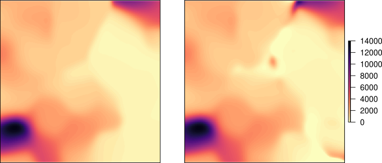

```{r setup, include=FALSE}
knitr::opts_chunk$set(echo = TRUE)
```

## sdcSpatial (2019): Privacy protected maps


Create density maps that protect privacy of individual observations.

### R package `sdcSpatial` has methods for:

- _Creating_ a _raster_ map: `sdc_raster` for pop density, value density and mean
density, using the excellent `raster` [@Hijmans2019].
- _Finding out_ which locations are _sensitive_: `plot_sensitive`, `is_sensitive`.
- Adjusting raster map for _protecting data_: `protect_smooth`, `protect_quadtree`
- _Removing sensitive_ locations.
- New: Adjust with **adaptive smoothing**  [@Hut2020] `protect_adaptive`.


<!-- ## Sdc in `sdcSpatial`? -->

<!-- SDC = "Statistical Disclosure Control" -->

<!-- ### Collection of statistical methods to: -->

<!-- - Check if data is safe to be published -->
<!-- - Protect data by slightly altering (aggregated) data -->
<!--   - adding noise, (e.g. R packages sdcTable, sdcMicro) -->
<!--   - shifting mass -->
<!-- - Most SDC methods operate on records: (e.g. R packages sdcTable, sdcMicro) -->
<!-- - **`sdcSpatial` works upon locations.** -->

## Data 

```{r}
data(dwellings, package="sdcSpatial")
nrow(dwellings)
head(dwellings) # consumption/unemployed are simulated!
```


## Let's create a `sdc_raster`

### Creation:

\scriptsize

```{r}
library(sdcSpatial)
consumption <- sdc_raster( dwellings[c("x", "y")] # realistic locations
                        , dwellings$consumption # simulated data!
                        , r = 500 # raster resolution of 500m
                        , min_count = 10 # min support
                        )
```

### What has been created?

\scriptsize
```{r}
print(consumption)
```

### 

42% of the data on this map is sensitive!

## Plotting a `sdc_raster`

```{r, out.height="70%"}
plot(consumption, "mean")
```

## How to reduce sensitivity?

### Options: 

a) Use a coarser raster: `sdc_raster`.
b) Remove sensitive locations: `remove_sensitive`.
c) Aggregate sensitive cells hierarchically with a quad tree until not 
sensitive: `protect_quadtree` [@Sune2017].
d) Apply spatial smoothing: `protect_smooth` [@WolfJonge2018].
e) **Apply adaptive smoothing: `protect_adaptive` [@Hut2020].**

## Why adaptive smoothing?

- Spatial phenomena are not uniformly distributed.

- "**One bandwidth** to rule them all", is not optimal. In practice
 choice of band width often is trade off, between high and low density areas.

- **Adaptive smoothing** take the density into account: high populated areas detailed,
low populated areas more smooth. 


## Sensitive / Unsafe definition [@Hut2020]

### Extented $p\%$-rule: $(p\%, \alpha)$

For $0 < p \leq 100$ and $0\leq\alpha <1$, a plot is said to be \emph{unsafe according to the $(p\%,\alpha)$ rule for an attacker scenario} 
whenever the estimates $\hat{g}_i$ of $g_i$, $i=1,\ldots,N$, computed according to the scenario, satisfy
\begin{equation} \label{e:palpha}
\max_{i=1,\ldots,N} P\left\{\left|\frac{\hat{g}_i-g_i}{g_i}\right| < \frac{p}{100}\right\} > \alpha,
\end{equation}
where we take $|(\hat{g}_i-g_i)/g_i| = |\hat{g}_i|$ if $g_i=0$.

## Add adaptive noise to kde

Method works by adding adaptive noise, to the kernel density estimation:

\begin{equation} \label{e:ploterror}  
\Tilde{m}_h(\vec{r}) = \frac{\sum_{i=1}^N g_i k\left((\vec{r}-\vec{r}_i)/h\right)+\epsilon(\vec{r})}{\sum_{i=1}^N k\left((\vec{r}-\vec{r}_i)/h\right)}, \quad \vec{r}\in\mathcal{D},  
\end{equation}

With $\epsilon(\vec{r})$ a Gaussion Random Field.

## "In Words"

- The noise adapts to intensity (point density) and to value density.
- low data density generates more noise. (potential disadvantage).
- For real use cases this seems to work.

## Smoothing (left) vs adaptive smoothing (right)

```{r, echo = FALSE, out.width="90%"}

```


## sdcSpatial in 5 lines: visual interpolation

\scriptsize
```{r, out.height="70%"}
unemployed <- sdc_raster(dwellings[c("x","y")], dwellings$unemployed, r=500)
unemployed_smoothed <- protect_smooth(unemployed, bw = 1500)
unemployed_safe <- remove_sensitive(unemployed_smoothed)
mean_unemployed <- mean(unemployed_safe)
raster::filledContour(mean_unemployed, main="Unemployment rate")
```

## The end

### Thank you for your attention!

### Questions?

### Curious?

```{r, eval=FALSE}
install.packages("sdcSpatial")
```

### Feedback and suggestions?

<https://github.com/edwindj/sdcSpatial/issues>

## References
