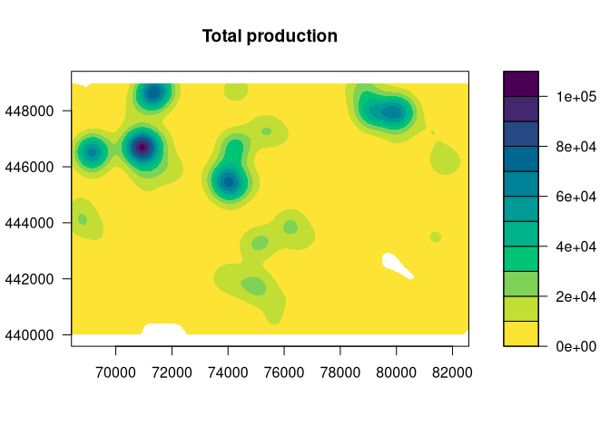

<!-- README.md is generated from README.Rmd. Please edit that file -->

sdcSpatial
==========

*Publishing a raster density map can reveal sensitive values*.
`sdcSpatial` is an opensource R package for creating spatial density
(raster) maps from point data while protecting the privacy of individual
observations.

`sdcSpatial` offers a `sdc_raster` class that allows to:

-   find out which locations are considered sensitive / unsafe for
    publishing: `plot_sensitive`, `is_sensitive`, `sensitivity_score`.
-   apply protection methods that reduce sensitiviy and enhance spatial
    patterns: `protect_smooth`, `protect_quadtree`.
-   remove sensitive locations: `remove_sensitive`.
-   extract relative as well as absolute density `raster`s that can be
    used with visualisation packages, such as `tmap` and `leaflet`:
    `x$value$mean`, `x$value$sum`, `mean`, `sum`.

Installation
------------

    install.packages("sdcSpatial")

To install the current development version of `sdcSpatial` with
`devtools`

    remotes::install_github("edwindj/sdcSpatial")

Example
-------

    library(sdcSpatial)
    library(raster)
    #> Loading required package: sp

    data(enterprises)

    # create a sdc_raster from point data with raster with
    # a resolution of 200m
    production <- sdc_raster(enterprises, variable = "production"
                            , r = 200, min_count = 3)

    print(production)
    #> numeric sdc_raster object: 
    #>    resolution: 200 200 ,  max_risk: 0.95 , min_count: 3 
    #>    mean sensitivity score [0,1]:  0.6328234

    # plot the raster
    zlim <- c(0, 3e4)
    # show which raster cells are sensitive
    plot(production, zlim=zlim)

    # but we can also retrieve directly the raster
    sensitive <- is_sensitive(production, min_count = 3)
    plot(sensitive, col = c('white', 'red'))

    # what is the sensitivy fraction?
    sensitivity_score(production)
    #> [1] 0.6328234
    # or equally
    cellStats(sensitive, mean)
    #> [1] 0.6328234

    # let's smooth to reduce the sensitivity
    smoothed <- protect_smooth(production, bw = 400)
    plot(smoothed)

    # let's smooth to reduce the sensitivity, with higher resolution
    smoothed <- protect_smooth(production, bw = 400, fact=4, keep_resolution=FALSE)
    plot(smoothed)

    # what is the sensitivy fraction?
    sensitivity_score(smoothed)
    #> [1] 0.007962441

    # let's remove the sensitive data.
    smoothed_safe <- remove_sensitive(smoothed, min_count = 3)
    plot(smoothed_safe)

    # let's communicate!
    production_mean <- mean(smoothed_safe)
    production_total <- sum(smoothed_safe)

    # and create a contour plot
    raster::filledContour(production_mean, nlevels = 6, main = "Mean production")

    # generated with R 3.6 >=
    #col <- hcl.colors(11, rev=TRUE)
    col <- c("#FDE333", "#C2DE34", "#7ED357", "#00C475", "#00B28A", "#009B95"
            ,  "#008298", "#006791", "#274983", "#44286E", "#4B0055"
            )
    raster::filledContour(production_total, nlevels = 11
                 , col = col
                 , main="Total production")

