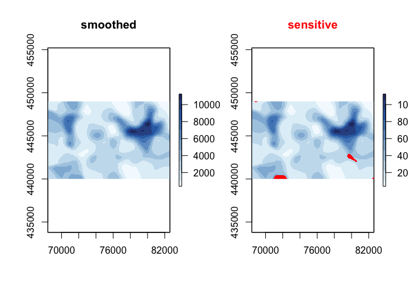

<!-- README.md is generated from README.Rmd. Please edit that file -->

[](https://cran.r-project.org/package=sdcSpatial)
[](https://travis-ci.org/edwindj/sdcSpatial)
[](https://ci.appveyor.com/project/edwindj/sdcSpatial)

# sdcSpatial

`sdcSpatial` is an opensource R package to create spatial density
(raster) maps from point data while protecting the privacy of individual
observations. *Using standard rastering or density estimation for
creating maps to be published can reveal sensitive values at locations*.

`sdcSpatial` offers a `sdc_raster` class that allows to:

  - find out which locations are considered sensitive / unsafe for
    publishing: `plot_sensitive`, `is_sensitive`, `sensitivity_score`.
  - apply protection methods that reduce sensitiviy and enhance spatial
    patterns: `protect_smooth`
  - remove sensitive locations: `remove_sensitive`.
  - extract relative as well as absolute density `raster`s that can be
    used with visualisation packages, such as `tmap` and `leaflet`:
    `x$value$mean`, `x$value$sum`, `mean`, `sum`.

## Installation

Currently `sdcSpatial` can only be installed with `devtools`

``` r
remotes::install_github("edwindj/sdcSpatial")
```

## Example

``` r
library(sdcSpatial)
library(raster)
#> Loading required package: sp

# create a sdc_raster from point data with raster with resolution of 200m
production <- sdc_raster(enterprises, variable = "production", r = 200, min_count = 3)

print(production)
#> numeric sdc_raster object: 
#>    resolution: 200 200 ,  max_risk: 0.95 , min_count: 3 
#>    mean sensitivity score [0,1]:  0.6328234

# plot the raster
zlim <- c(0, 3e4)
# show which raster cells are sensitive
plot(production, zlim=zlim)
```


``` r

# but we can also retrieve directly the raster
sensitive <- is_sensitive(production, min_count = 3)
plot(sensitive, col = c('white', 'red'))
```


``` r

# what is the sensitivy fraction?
sensitivity_score(production)
#> [1] 0.6328234
# or equally
cellStats(sensitive, mean)
#> [1] 0.6328234

# let's smooth to reduce the sensitivity
smoothed <- protect_smooth(production, bw = 400)
plot(smoothed)
```


``` r

# what is the sensitivy fraction?
sensitivity_score(smoothed)
#> [1] 0.1779744

# let's remove the sensitive data.
smoothed_safe <- remove_sensitive(smoothed, min_count = 3)
plot(smoothed_safe, zlim=zlim)
```



``` r

# let's communicate!
production_mean <- mean(smoothed_safe)
production_total <- sum(smoothed_safe)

# and cread
filledContour(production_mean, nlevels = 6, main = "Mean production")
```


``` r
filledContour(production_total, nlevels = 10, col = hcl.colors(11), main="Total production")
```


