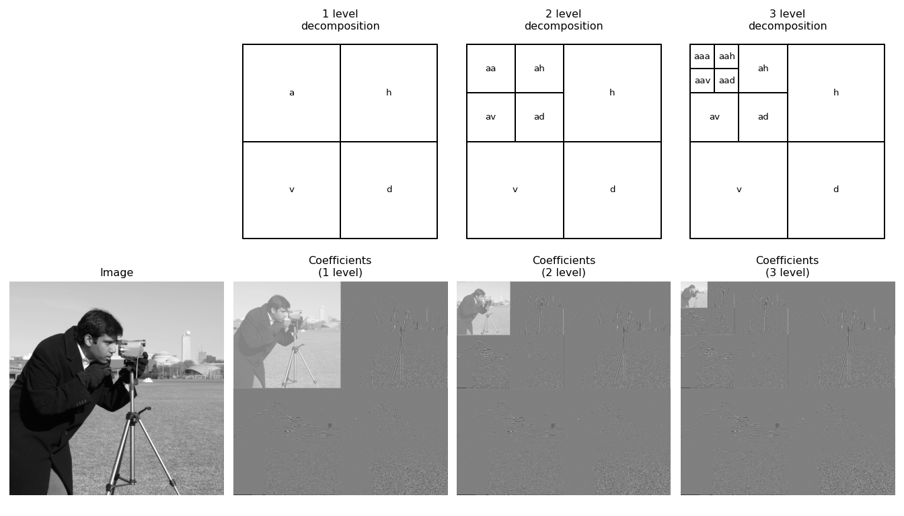

```{r setup, include=FALSE}
knitr::opts_chunk$set(echo = TRUE)
```

## Enhancing privacy protected maps

```{r, echo=FALSE}

```

## Who am I?

- Statistical consultant, Data Scientist \@cbs.nl / Statistics NL
- Statistics Netherlands (CBS) is producer main official statistics in the 
Netherlands:

    - Stats on Demographics, economy (GDP), education, environment, agriculture, 
Finance etc.
    - Part of the European Statistical System, ESS
    - Like DEStatis, only national office (smaller country...) 


## Some Aspects Geographical confidentiality 

- Legal, what is allowed?
- Cultural, what is considered sensitive?
- Computational (methods)
- What kind of Information?
- Combining sources with spatial information
- Analysing geo-referenced data, who has access?
- Publishing geo-referenced data
- Tension between privacy and public safety. In times of crisis... 
(i.e. COVID19 pandemic)


## Context in European context is different.

- Privacy and sensitive information is not an absolute thing.

- Government should protect their citizens and citizen should be protected by their government. 

- sensitive information of citizens should be not be disclosed. 

- What is sensitive is not an absolute given:

- Cultural component:

  e.g. Scandanavian countries had a public register of income. 
  
## Country context can be different

- In the Netherlands there is a public register of buildings and addresses.
who is residing there is not public though.

## This presentation

- Legal
- Cultural
- Computational
- kind of information
- Combining information with spatial information
- Analysing geo-referenced data, who has access?
- **Publishing geo-referenced data on maps**
- Tension between privacy and public safety. In times of crisis... 
(i.e. COVID19 pandemic)


## This presentation

- Being a statistical office, we do not disclose information of individuals.
- Main task is to compile information on population level.
- **Will focus on methods of publication of (density) maps**

- Focus on publishing regional data, i.e. on the population living or operating in the spatial dimension. 

- e.g. Unemployment, or Spatial distribution of income etc.

- So we are talking about "aggregated" data: and the protection takes place at 
an aggregate level, not on a microlevel. Which is a different topic.

- Assumption: the raw / original data has most information / utility. (come back later)

## This presentation

- Uses a lot of material from Guidelines for Statistical Disclosure Control 
Methods Applied on Georeference Data, [@guidelines2024] (to be published)

- contains examples with R package: `sdcSpatial` 

- Describes methods and their aspects

- Introduces a new adaptive wavelet method.

## Publishing maps

- Demand of policymakers and society to have ever more detailed spatial detail.
- Often on administrative regions
- More detail, more risk for disclosing individual information...

### Maps for a long time:

- Attractive and useful means for displaying spatial data (maps earlier then charts...)
- Maps may disclose information on individuals
- Different type of maps:  Proportional Symbol Maps, Choropleths, Density maps 

## Map: proportional symbol

```{r, echo=FALSE,out.height="79%"}
knitr::include_graphics("fig/proportGermany.png")
```

## Map: proportional symbol:

- Used for a long time (1858, Minard)
- Publish **absolute numbers**
- Can be multi variate
- Mostly on administrative regions
- Privacy protection methods: same as tabular
methods, "it's just a table".
- *Spatial dimension (mostly) not used*

## Maps: choropleth:

```{r, echo=FALSE,out.height="79%"}
knitr::include_graphics("fig/choroGermany.png")
```

## Maps: choropleth:

- Choropleth: **relative numbers** (percentage/density)
- Mostly univariate
- Mostly on administrative regions
- Privacy protection methods: same as tabular
methods, "it's just a table".
- *Spatial dimension (mostly) not used*

## Map: density maps

```{r, echo=FALSE, out.height="79%"}
knitr::include_graphics("fig/germanyPopDens1200.png")
```

## Map: density maps

- **absolute** or **relative** numbers

## Demands:

- Each maps has their use
- Density maps are under used, but have the following nice properties:

    - no administrative region size bias (distortion)
    - resolution can be choosen (oops)
    - can depict absolute densities: e.g. population density, unemployed.
    - can depict relative densities: unemployment *rate*.


## KDE

$$
f_h(r) = \frac{1}{h^2} \sum_{i=1}^N \big(\frac{r-r_i}{h}\big)
$$


## Software sdcSpatial

## sdcSpatial: Privacy protected maps

### `sdcSpatial` and Wavelets:

- `sdcSpatial` helps to assess sensitiviy and create privacy protected density maps.

- `protect_wavelet` novel method for protecting density maps.

- takes care of rural vs urban spatial resolution.

- can be seen as combination of `protect_smooth` and `protect_quadtree`.

## Sdc in `sdcSpatial`?

SDC = "Statistical Disclosure Control"

### Collection of statistical methods to:

- Check if data is safe to be published
- Protect data by slightly altering (aggregated) data
  - adding noise
  - shifting mass
- Most SDC methods operate on records.
- **`sdcSpatial` works upon locations.**

## resolution

```{r, echo=FALSE, out.width="85%"}
knitr::include_graphics("fig/resolution.png")
```

## Disclosure risk 

Disclosure risk scenario:
Plotting a variable on a map:

- The location of a population unit is very identifying.
- zooming in makes it easy to pinpoint the exact
location of a population unit.
- The value of the variable at a certain location may be sensitive information.
- Densely of sparsely populated regions, implies identifiability

## Disclosure scenario

Attacker:

- identifies hot / cold spots: locations that have extreme values or low density.
- Zooming in the map
- Identifies locations of individuals 
- Connects the value with the individuals.

## Risk measure (general)

For each area $A$ (can be overlapping):

- the number of units $n$, should be at least $k$ (k-anonymity)
- the largest value of a unit should be lower then $p\%$ of the total
value (dominance rule).

## Information loss

- Protecting privacy  is removing information
- Perfectly safe data is publishing no data
- Strive for maximum utility (or information), while removing risk     (removing information).
- Note: utility is not necessarily maximum information: raw individual data can be noisy, incomplete, etc.
- Look at information measures

## Information loss measures

(from Guidelines on Georeferenced data, 2024)

- Hellinger Distance, MSE, MAD on grid
- Earth Moving Distance

## Methods

- Quadtree
- Kernel Density Smoothing
- Wavelet Adaptive Smoothing

## Quadtree

```{r, echo=FALSE, out.width="65%"}
knitr::include_graphics("fig/quadtree2.png")
```

[@Lagonigro_Oller_Martori_2017]

## Quadtree

```{r, echo=FALSE, out.width="65%"}
knitr::include_graphics("fig/quadtree.png")
```

[@Lagonigro_Oller_Martori_2017]

## Quadtree problem

```{r, echo=FALSE, out.width="65%"}
knitr::include_graphics("fig/quadtree_problem.png")
```

from: [@Guidelines2024]

## Data 

```{r}
data(dwellings, package="sdcSpatial")
nrow(dwellings)
head(dwellings) # consumption/unemployed are simulated!
```


## Let's create a `sdc_raster`

### Creation:

\scriptsize

```{r}
library(sdcSpatial)
unemployed <- sdc_raster( dwellings[c("x", "y")] # realistic locations
                        , dwellings$unemployed # simulated data!
                        , r = 500 # raster resolution of 500m
                        , min_count = 10 # min support
                        )
```

### What has been created?

\scriptsize
```{r}
print(unemployed)
```

### 

42% of the data on this map is sensitive and should be protected!

## Type of raster density maps:

(Stored in `unemployed$value`):

Density can be area-based:

- **number of people** per square (`$count`): population density.
- **(total) value** per square (`$sum`): number of unemployed per square.

Or density can population-based:

- **Mean value** per square (`$mean`): unemployment rate per square.

_Note: All density types are valid, but (total) value per square 
strongly interacts with population density.  
(e.g. <https://xkcd.com/1138>)_.

## Plotting a `sdc_raster`

```{r, out.height="70%"}
plot(unemployed, "mean")
```

## How to reduce sensitivity?

### Options: 

a) Remove sensitive locations: **`remove_sensitive`**.
b) Use a coarser raster: `sdc_raster`.
c) Aggregate sensitive cells hierarchically with a quad tree until not 
sensitive: **`protect_quadtree`** [@Sune2017, @Lagonigro_Oller_Martori_2017].
d) Apply spatial smoothing: **`protect_smooth`** [@WolfJonge2018; @JongeWolf2016].
e) Do a multi-resolution analysis **`protect_wavelet`**


## Option: `protect_quadtree`

\scriptsize
```{r, warning=FALSE, out.height="70%"}
unemployed_100m <- sdc_raster( dwellings[c("x","y")], dwellings$unemployed
                             , r = 100) # use a finer raster
unemployed_qt <- protect_quadtree(unemployed_100m)
plot(unemployed_qt)
```

## Option: `protect_quadtree`

### Pro

- Adapts to data density
- Adjusts until no sensitive data is left.
- It just works...

### Cons

- Crude, it just works :-) 
- Visually: "Blocky" / "Mondrian-like" / Minecraft-result
- Is not translation invariant (basis)
- Isn't there something smoother?

## Option: `protect_smooth`

\scriptsize 

```{r, out.height="70%", warning=FALSE}
unemployed_smoothed <- protect_smooth(unemployed, bw = 1500)
plot(unemployed_smoothed, "mean")
```


## Option: `protect_smooth`

### Pro's

- Often enhances spatial pattern visualization, removing spatial noise.
- Makes it a density map and used as source for e.g. contour map.

### Con's

- Does not remove all sensitive values (depends on bandwidth `bw`)
- A fixed band width is used for all locations: may remove detailed patterns...  
spatial processes often have location dependent band widths.


## Problem: smooth and adaptive

We need both a smooth and adaptive method!

### Wavelets

- Used for multi-resolution analysis (MRA), decompose signal / image at multiple
resolutions.
- Used for denoising images: ("did I hear smoothing"?)

Also: 
- Used for lossy compression of images (e.g. JPEG!)

### We skip the math

- Except: wavelet decomposition can have different base functions, e.g. Haar, Daubechies etc.

## Wavelet and images (e.g. JPEG)


```{r, echo=FALSE, out.width="85%"}

```


## sdcSpatial and Wavelets:

- Enter: `protect_wavelet`
- Using `dwt.2d`and `waveslim::idwt.2d` of R package `waveslim` [@Whitcher2024]
- Builds a multi-resolution version of density map
- Checks sensitivity (privacy) multiple resolutions

```{r, eval=FALSE}
unemployed_wvlt <- protect_wavelet(
  unemployed,
  wf = "la8", # wavelet transform / base functions
  depth = 4, # resolution depth
  ... # denoising parameters
)
```

## The end

- `protect_wavelet` (work in progress) on github
- "raw version", testing make it user friendly, in December on CRAN.

### Thank you for your attention!

### Questions?

### Curious?

```{r, eval=FALSE}
install.packages("sdcSpatial")
```

### Feedback and suggestions?
<https://github.com/edwindj/sdcSpatial>

## References

\scriptsize
