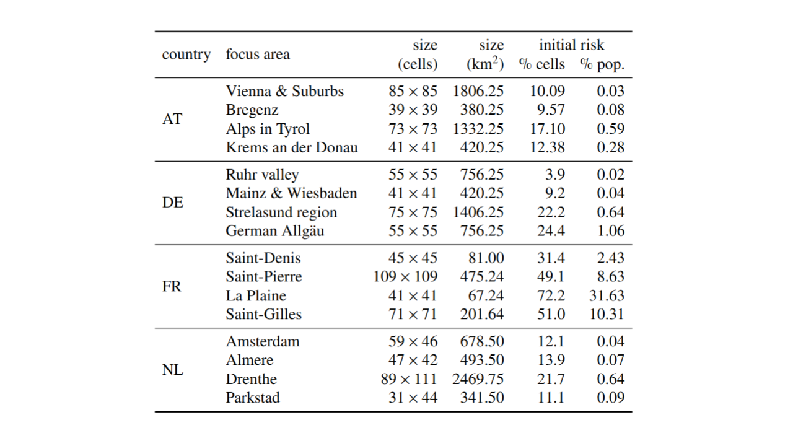
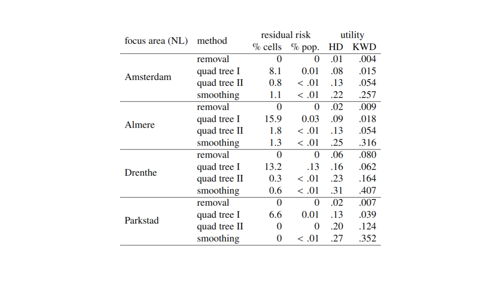

```{r setup, include=FALSE}
knitr::opts_chunk$set(
   echo = TRUE,
   out.height = "70%",
   warning = FALSE
)
library(sdcSpatial)
```

## sdcSpatial: Privacy protected maps

```{r, echo=FALSE}
knitr::include_graphics("fig/privacy.jpg")
```

## sdcSpatial: take home message

### Experiments with `sdcSpatial`

- sdcSpatial [@dejonge2022, @WolfJonge2018], 
- AT, DE, FR, NL experiments population density
- different utility measures tested
- different types of focus areas

### `sdcSpatial` has methods for:

- **Creating** a **raster** map: `sdc_raster` for pop density, value density and mean
density, using the excellent `raster` [@Hijmans2019].
- **Finding out** which locations are **sensitive**: `plot_sensitive`, `is_sensitive`.
- Adjusting raster map for **protecting data**: `protect_smooth`, `protect_quadtree`.
- **Removing sensitive** locations: `remove_sensitive`


## Why sdcSpatial?

- ESS has European Code of Statistical Practice (predates GDPR, European law 
on Data Protection):  
**no individual information may be revealed**.

## Sdc in `sdcSpatial`?

SDC = "Statistical Disclosure Control"

### Collection of statistical methods to:

- Check if data is safe to be published
- Protect data by slightly altering (aggregated) data
  - adding noise
  - shifting mass
- Most SDC methods operate on records.
- **`sdcSpatial` works upon locations.**

## What is sdcSpatial good for?

### Protecting 
- *Spatial Population density*
- Spatial value density, e.g. unemployment, income 
- Spatial fractions, e.g. unemployment rate
- Spatial averages, e.g. average income

We'll focus on population density

## Experiments with `sdcSpatial`

Using `sdcSpatial` for AT, FR, DE and NL to protect population density, i.e.
to "grid locations" with < 10 persons [@Gussenbauer2023]

- 4 different area's per country: urban, moderately urban, rural, border area
- different utility measures, Hellinger distance, Moran's I
-  3 different methods: (next slides)

## Example: unprotected

\scriptsize

```{r, out.height="70%"}
population <- sdc_raster( dwellings[c("x","y")]
                        , variable = 1
                        , min_count = 10
                        , r = 500)
plot(population, value="count")
```


## Cell removal: `remove_sensitive`

- Just remove the unsafe cells
- Pro: simple, fast, no artifacts introduced
- Con: looses mass, low density areas are removed

```{r, out.height="70%", warning=FALSE, echo=FALSE}
pop_removed <- population |> remove_sensitive()
plot(pop_removed, value = "count")
```

## Smoothing: `protect_smooth`

- Spatial smoothing, unsafe locations are "blurred"
- Pro: highlights spatial pattern, removes spatial noise
- Con: Loose mass at edges, Introduces unplausible locations.

```{r, out.height="70%", warning=FALSE, echo = FALSE}
pop_smoothed <- protect_smooth(population, bw = 500)
plot(pop_smoothed, "count")
```

## Quad tree: `protect_quadtree`

- Group unsafe cells, until safe
- Pro: protection garanteed, relative low adaption.
- Con: blocky result

```{r, warning=FALSE, out.height="70%", echo=FALSE}
pop_quad <- protect_quadtree(population, sensitive = FALSE)
plot(pop_quad, "count")
```

## Utility measures

### Hellinger Distance (HD)
- See Map as a table:
- Difference between unprotected and protected version (rmse diff of normalized data)
- Note: does not take spatial character into account!

### Kantorovic-Wasserstein Distance (KWD)
- Spatial distribution distance
- aka: earth movers distance, minimal spatial distribution adjustment
- using R package `SpatialKWD`
- Note: computational intensive


## Areas countries

```{r, echo=FALSE, out.width="80%"}

```

## Results (NL)

```{r, echo=FALSE, out.width="80%"}

```

## Discussion

- Using HD sdc-table-like measures, cell removal best, smoothing worse
- Same with spatial KWD!

### However...

- current utility measure look at individual differences
- It does not take spatial pattern/shape into account
- Smoothing may _create_ utility, reducing noise.
- So looking into other utility spatial utility measures.

## Upcoming changes sdcSpatial 0.7

- Hellinger Distance (HD): `distance_hellinger()`
- speed improvements:
  - raster construction (faster)
  - smoothing (much more efficient): from city size to country size.
  
- tbp in January 2024


## Thank you for your attention!

### Questions?

### Curious?

```{r, eval=FALSE}
install.packages("sdcSpatial")
```

### Feedback and suggestions?

<https://github.com/edwindj/sdcSpatial/issues>

## References
