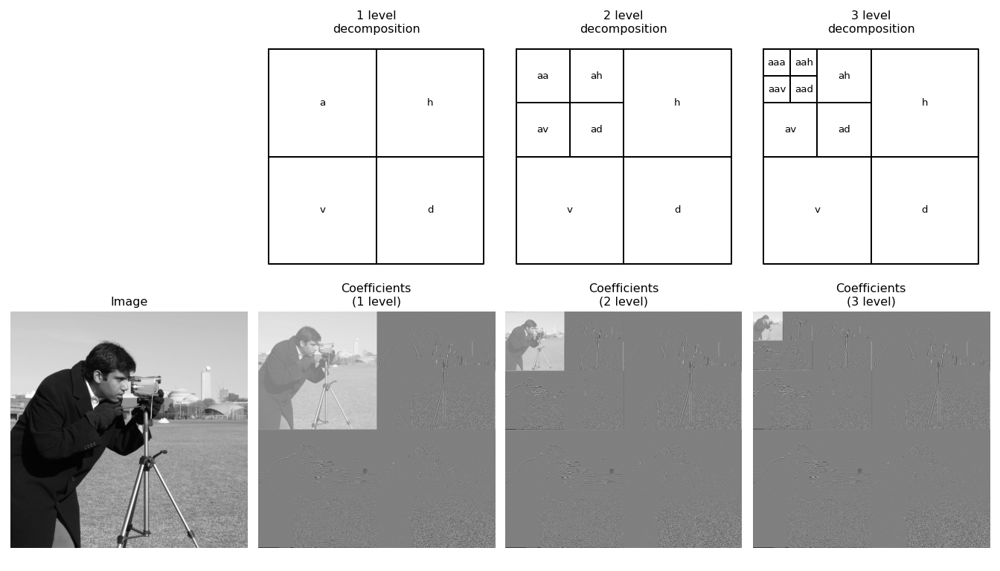
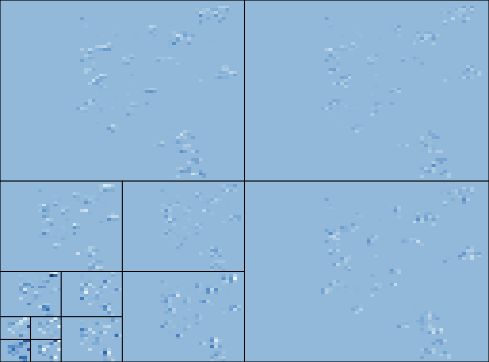
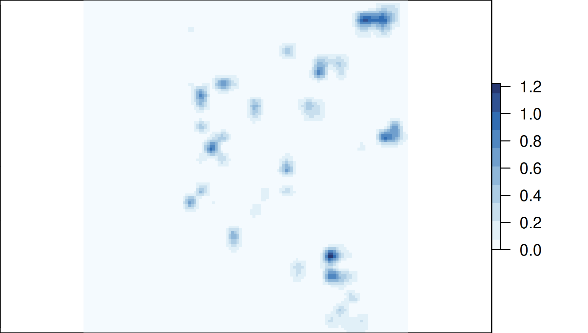

```{r setup, include=FALSE}
knitr::opts_chunk$set(echo = TRUE)
```

## Wavelet Secure Maps: enhancing privacy protected maps

```{r, echo=FALSE}
knitr::include_graphics("fig/privacy.jpg")
```

## sdcSpatial: Privacy protected maps

### Takeout message: `sdcSpatial` and Wavelets:

- `sdcSpatial` helps to assess sensitiviy and create privacy protected density maps.

- `protect_wavelet` novel method for protecting density maps.

- takes care of rural vs urban spatial resolution.

- can be seen as combination of `protect_smooth` and `protect_quadtree`.

- _work in progress, on github, not yet on CRAN_

## Who am I and why these protection methods?

- Statistical consultant, Data Scientist \@cbs.nl / Statistics NL
- Statistics Netherlands is producer main official statistics in the 
Netherlands:

    - Stats on Demographics, economy (GDP), education, environment, agriculture, 
Finance etc.
    - Part of the European Statistical System, ESS.

### Motivation for `sdcSpatial`

- ESS has European Code of Statistical Practice (predates GDPR, European law 
on Data Protection):  
**no individual information may be revealed**.

## Sdc in `sdcSpatial`?

SDC = "Statistical Disclosure Control"

### Collection of statistical methods to:

- Check if data is safe to be published
- Protect data by slightly altering (aggregated) data
  - adding noise
  - shifting mass
- Most SDC methods operate on records.
- **`sdcSpatial` works upon locations.**

## Data 

```{r}
data(dwellings, package="sdcSpatial")
nrow(dwellings)
head(dwellings) # consumption/unemployed are simulated!
```


## Let's create a `sdc_raster`

### Creation:

\scriptsize

```{r}
library(sdcSpatial)
unemployed <- sdc_raster( dwellings[c("x", "y")] # realistic locations
                        , dwellings$unemployed # simulated data!
                        , r = 500 # raster resolution of 500m
                        , min_count = 10 # min support
                        )
```

### What has been created?

\scriptsize
```{r}
print(unemployed)
```

### 

42% of the data on this map is sensitive and should be protected!

## Type of raster density maps:

(Stored in `unemployed$value`):

Density can be area-based:

- **number of people** per square (`$count`): population density.
- **(total) value** per square (`$sum`): number of unemployed per square.

Or density can population-based:

- **Mean value** per square (`$mean`): unemployment rate per square.

_Note: All density types are valid, but (total) value per square 
strongly interacts with population density.  
(e.g. <https://xkcd.com/1138>)_.

## Plotting a `sdc_raster`

```{r, out.height="70%"}
plot(unemployed, "mean")
```


## How to reduce sensitivity?

### Options: 

a) Remove sensitive locations: **`remove_sensitive`**.
b) Use a coarser raster: `sdc_raster`.
c) Aggregate sensitive cells hierarchically with a quad tree until not 
sensitive: **`protect_quadtree`** [@Sune2017].
d) Apply spatial smoothing: **`protect_smooth`** [@WolfJonge2018; @JongeWolf2016].
e) Do a multi-resolution analysis **`protect_wavelet`**


## Option: `protect_quadtree`

\scriptsize
```{r, warning=FALSE, out.height="70%"}
unemployed_100m <- sdc_raster( dwellings[c("x","y")], dwellings$unemployed
                             , r = 100) # use a finer raster
unemployed_qt <- protect_quadtree(unemployed_100m)
plot(unemployed_qt)
```

## Option: `protect_quadtree`

### Pro

- Adapts to data density
- Adjusts until no sensitive data is left.
- It just works...

### Cons

- Crude, it just works :-) 
- Visually: "Blocky" / "Mondrian-like" / Minecraft-result
- Is not translation invariant (basis)
- Isn't there something smoother?

## Option: `protect_smooth`

\scriptsize 

```{r, out.height="70%", warning=FALSE}
unemployed_smoothed <- protect_smooth(unemployed, bw = 1500)
plot(unemployed_smoothed, "mean")
```


## Option: `protect_smooth`

### Pro's

- Often enhances spatial pattern visualization, removing spatial noise.
- Makes it a density map and used as source for e.g. contour map.

### Con's

- Does not remove all sensitive values (depends on bandwidth `bw`)
- A fixed band width is used for all locations: may remove detailed patterns...  
spatial processes often have location dependent band widths.

## Problem: smooth and adaptive

We need both a smooth and adaptive method!

### Wavelets

- Used for multi-resolution analysis (MRA), decompose signal / image at multiple
resolutions.
- Used for denoising images: ("did I hear smoothing"?)

Also: 
- Used for lossy compression of images (e.g. JPEG!)

### We skip the math

- Except: wavelet decomposition can have different base functions, e.g. Haar, Daubechies etc.

## Wavelet and images (e.g. JPEG)


```{r, echo=FALSE, out.width="90%"}

```

## 

```{r, echo=FALSE, out.width="90%"}

```


## sdcSpatial and Wavelets:

- Enter: `protect_wavelet`
- Using `dwt.2d`and `waveslim::idwt.2d` of R package `waveslim` [@Whitcher2024]
- Builds a multi-resolution version of density map
- Checks sensitivity (privacy) multiple resolutions

```{r, eval=FALSE}
unemployed_wvlt <- protect_wavelet(
  unemployed,
  wf = "la8", # wavelet transform / base functions
  depth = 4, # resolution depth
  ... # denoising parameters
)
```


## 

```{r, echo=FALSE, out.width="90%"}

```

## The end

- `protect_wavelet` **wip on github**, highly in flux.
- "raw version", testing make it user friendly, in September on CRAN.
- update will also include:

    - Hellinger distance for measuring "utility"
    - performance improvements large rasters (country size)

### Thank you for your attention!

### Questions?

### Curious?

```{r, eval=FALSE}
install.packages("sdcSpatial")
```

### Feedback and suggestions?
<https://github.com/edwindj/sdcSpatial>

## References
\scriptsize
